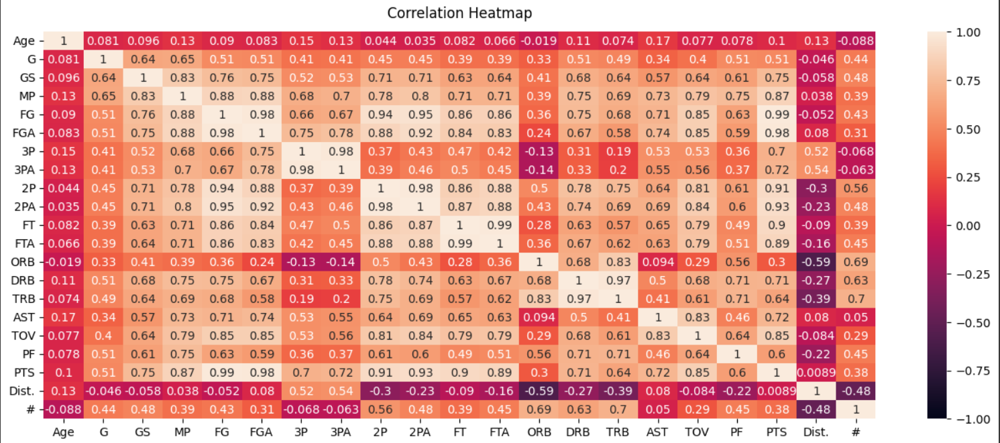
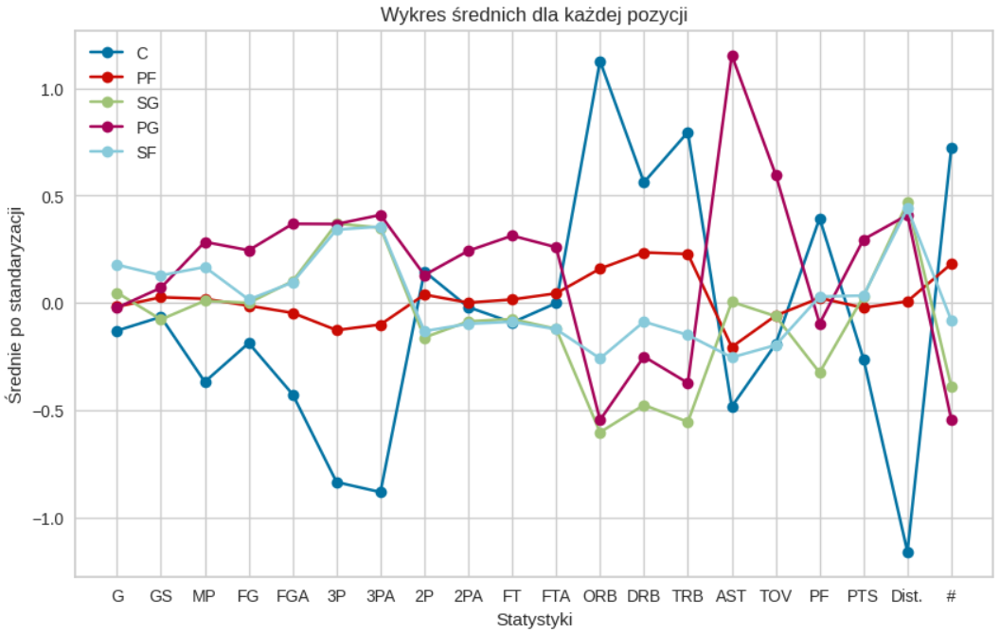
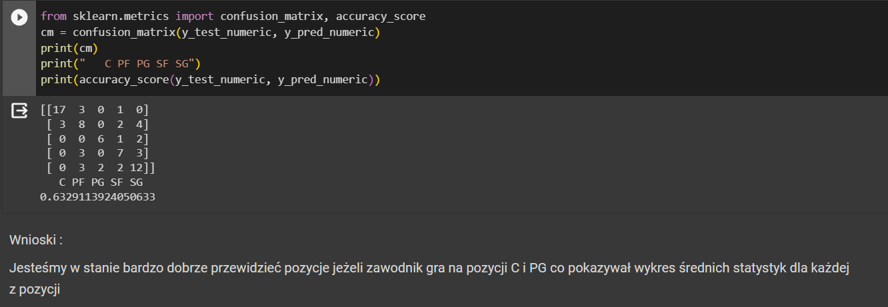

# NBA
## 🚀 Introduction
In my project I wanted to make a full analysis of NBA statistics unfortunately I can't share data but I wanted to share my conclusion.

[link do google colab](https://colab.research.google.com/drive/1JIBMqXwaRPHtDBHS6R5I9zU4dF7xl8d7)
## 🏀 Conclusion
### Correlation

### KMeans was used to group the player

### Average statistics for each position

### Trying to predict the position

